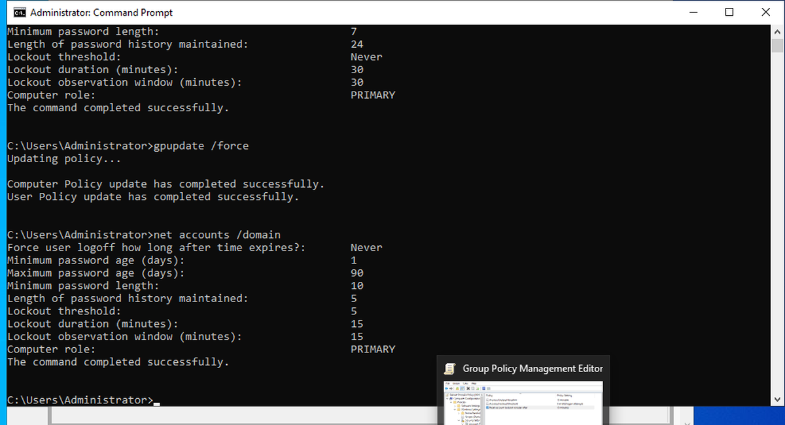
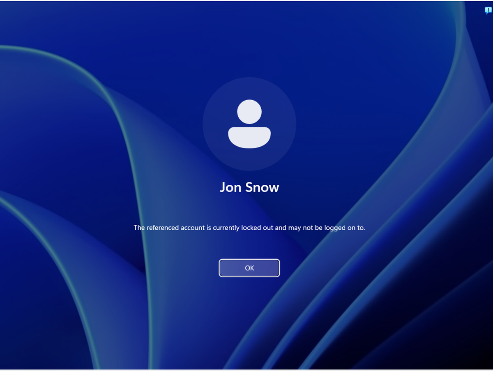
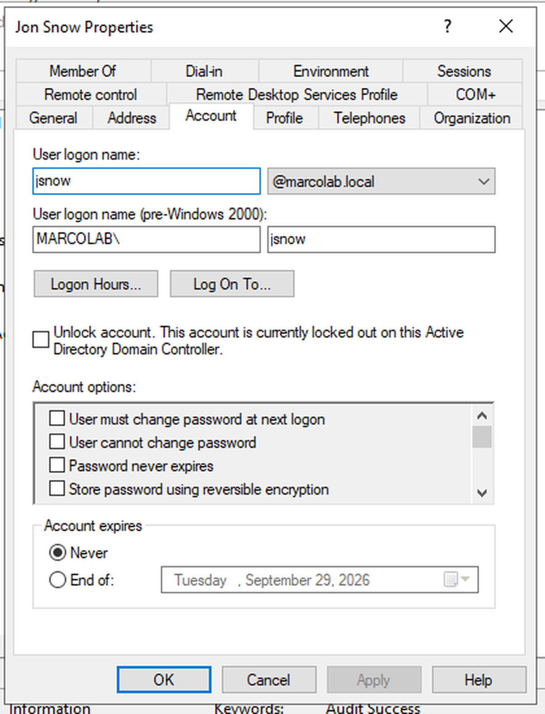
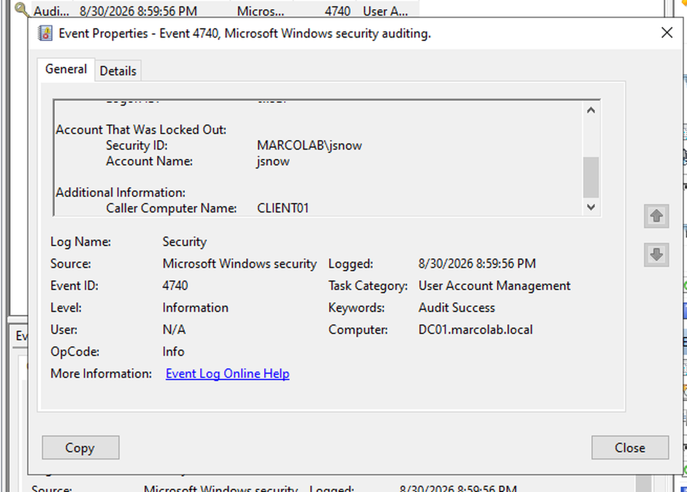
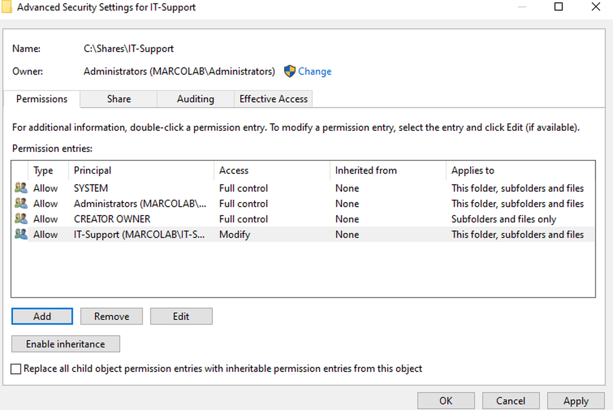
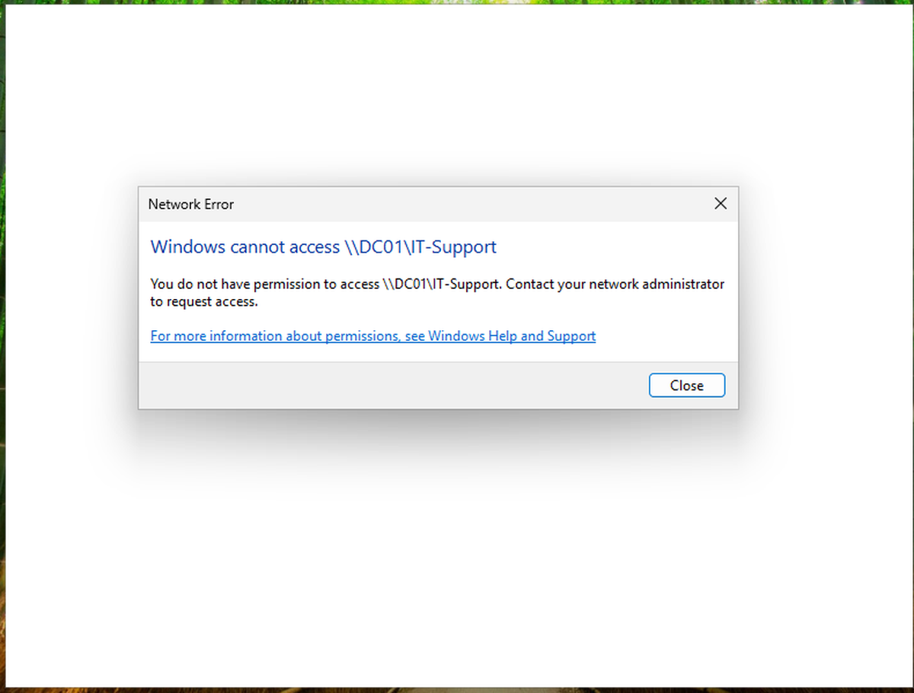
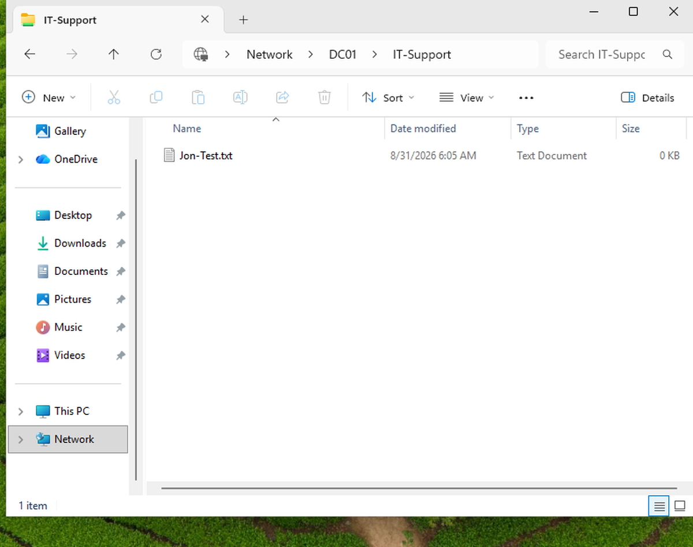

# Active Directory Security Lab

## Overview

This project is a virtual Windows enterprise environment built to practice Active Directory administration, identity and access management, Group Policy, DNS, and Windows security auditing.

The lab uses Windows Server 2022 as a domain controller and Windows 11 Pro as a domain-joined workstation. I created domain users, organizational units, security groups, password and account lockout policies, and role-based access controls. I also generated failed authentication attempts and investigated the resulting Windows security events.

## Lab Environment

- Oracle VirtualBox
- Windows Server 2022
- Windows 11 Pro
- Active Directory Domain Services
- DNS
- Group Policy
- Windows Event Viewer

### Systems

| System | Role | Lab IP |
|---|---|---|
| DC01 | Domain Controller / DNS Server | 192.168.50.10 |
| CLIENT01 | Windows 11 Domain Workstation | 192.168.50.20 |

**Domain:** `marcolab.local`

## Network Configuration

I created a private VirtualBox internal network so the domain controller and workstation could communicate with each other.

Both virtual machines also use NAT adapters for internet access.

`CLIENT01` was configured to use `DC01` as its DNS server so the workstation could locate Active Directory domain services.

During configuration, DNS initially returned additional addresses associated with the NAT adapter. I removed the unnecessary DNS records and verified that `marcolab.local` resolved to the domain controller's private IP address.

## Active Directory Configuration

I installed Active Directory Domain Services on `DC01` and promoted the server to a domain controller for the `marcolab.local` domain.

I created organizational units for:

- Employees
- Workstations
- Groups

I also created test domain users and a security group named `IT-Support`.

`CLIENT01` was joined to the domain and its computer object was moved into the Workstations organizational unit.

## Group Policy Security Controls

I configured domain password and account lockout policies through Group Policy.

### Password Policy

- Minimum password length: 10 characters
- Password history: 5 passwords
- Minimum password age: 1 day
- Maximum password age: 90 days
- Password complexity requirements: Enabled

### Account Lockout Policy

- Account lockout threshold: 5 failed attempts
- Account lockout duration: 15 minutes
- Reset account lockout counter after: 15 minutes

I verified the effective domain policy using:

`net accounts /domain`

## Account Lockout Testing

To test the account lockout policy, I intentionally entered an incorrect password multiple times for a test domain user from `CLIENT01`.

After the configured number of failed attempts, Windows prevented the user from signing in.

The account lockout was also visible through Active Directory Users and Computers on the domain controller.

## Windows Security Event Investigation

I reviewed the Security log on `DC01` using Windows Event Viewer.

The account lockout generated **Event ID 4740**, which indicates that a user account was locked out.

The event showed the affected domain account and identified `CLIENT01` as the computer associated with the lockout activity.

This demonstrated how Windows security logs can be used to investigate authentication activity in a domain environment.

## Role-Based Access Control

I created a restricted network share on `DC01`:

`\\DC01\IT-Support`

Access was controlled using the `IT-Support` Active Directory security group.

The `IT-Support` group was granted Modify permissions while general domain user access was removed from the folder's NTFS permissions.

### Unauthorized User Test

A domain user who was not a member of the `IT-Support` group attempted to open the network share and received an access denied message.

### Authorized User Test

A domain user who was a member of `IT-Support` successfully accessed the restricted share and created a test file.

This verified that access to the resource was being granted based on Active Directory security group membership.

## Troubleshooting

One issue encountered during the lab involved DNS resolution.

`CLIENT01` initially used the wrong DNS server and later received multiple addresses for the domain controller because addresses from the NAT adapter had been registered in DNS.

I corrected the DNS configuration, removed unnecessary DNS records, flushed the client DNS cache, and verified that the domain resolved to the correct private IP address.

I also verified Group Policy settings after configuration instead of assuming they were applied. When the first account policy configuration did not appear in the effective domain settings, I corrected the policy scope and confirmed the final settings using `net accounts /domain`.

## Skills Practiced

- Active Directory Domain Services
- Windows Server 2022
- Windows 11
- DNS
- Group Policy
- Organizational Units
- Domain Users and Security Groups
- Role-Based Access Control
- NTFS Permissions
- Share Permissions
- Windows Event Viewer
- Authentication Event Analysis
- TCP/IP
- Static IP Configuration
- VirtualBox
- Troubleshooting

## What I Learned

This project helped me understand how a Windows domain can centralize user authentication, computer management, security policy, and access control.

I gained hands-on experience creating and managing domain objects, configuring DNS, applying Group Policy settings, restricting resources with security groups, troubleshooting configuration issues, and reviewing Windows security events related to authentication activity.
